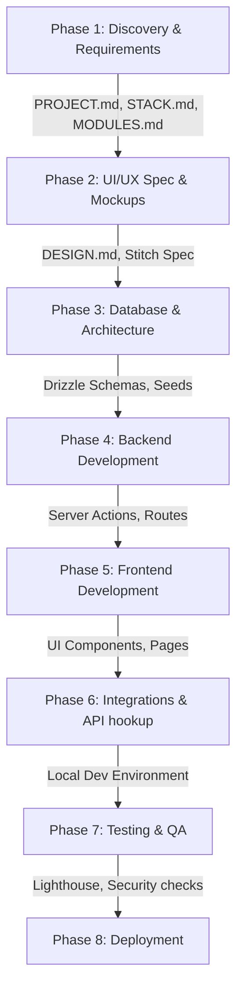

# Retrospective Workflow Audit: Susilodaya Dhamma School Platform
**Date of Audit:** July 5, 2026  
**Auditor:** Senior Technical Program Auditor  

---

## 1. Executive Summary

* **Crucial Specifications Ignored and Untracked:** The `.gitignore` file was configured from day one to ignore the entire `documentation/` directory (containing `requirements.md` and `features_report.md`), along with `design_direction.md` and `ANALYSIS-*.md`. This meant that all core client specifications and design research resided entirely outside version control, creating a fertile ground for silent drift and unverified changes.
* **Ad-Hoc Scope Expansion (The Missing Teacher Role):** The original client requirements document (`documentation/requirements.md`) explicitly specified only two user roles: `Admin` and `Student`. However, the agentic workflow introduced a third role, `Teacher` (with a complete portal, attendance logs, and exam dashboards), without updating the core requirements document, leading to an undocumented architectural expansion.
* **Massive UI Overhaul Loop:** Coding of core components (homepage, exams calendar, and enrollment stepper) originally proceeded using generic UI styles and rounded corners. On July 1st, a system-wide design change forced sharp corners, parchment textures, and cinematic animations, causing a cascade of code rewrites across 27 files in commits `85e1d1e` and `3bd749f`.
* **Design Token Contradictions:** The design system overhauled in `DESIGN.md` mandated `0px` border-radius globally. However, the floating glass navigation pill required rounded-full edges, resulting in a conflicting visual execution that had to be resolved using `!important` stylesheet overrides in `globals.css`.
* **Broken Logic vs. Style Hand-off (Greyscale Hover Bug):** The client-side gallery animations (`collage-gallery.tsx` and `magazine-gallery.tsx`) were configured to transition images from grayscale to color on hover. However, the server-side action in `cms.ts` was implemented to desaturate uploaded images using the `Jimp` library before saving, making it impossible for the client-side hover color transition to work.
* **Supabase Auth Schema Neglect:** The initial database configuration focused strictly on the public schema and neglected Supabase Auth's private `auth.users` and `auth.identities` schemas. This resulted in login failures, forcing the manual creation of raw SQL scratch scripts (`inspect_identities.ts`, `inspect_password.ts`) to seed and sync mock credentials.
* **Quiet Requirement Regressions (The Canvas Map Swap):** The client specified a custom vector-based `CanvasMap` to maintain performance budgets and avoid large external bundles. However, this component was quietly swapped out in the working directory for a standard iframe-based `GoogleMap`, which went unnoticed by the deployment and QA verification workflows.
* **Bypassed Issues Tracking:** The `.agents/memory/issues/` files remained completely empty throughout the development lifecycle, indicating that bugs and reworks were resolved ad-hoc in the terminal rather than being logged and tracked.

---

## 2. Reconstructed Workflow Map

* **Discovery & Requirements:** Gathers scope and outputs `PROJECT.md`, `STACK.md`, and `MODULES.md`.
* **UI/UX Spec & Mockups:** Creates `DESIGN.md` and generates visual specifications for Google Stitch.
* **Database & Architecture:** Initializes schemas, migrations, and mock data seeds.
* **Backend Development:** Writes server controllers, API endpoints, and auth routing.
* **Frontend Development:** Builds React components and layout pages according to design tokens.
* **Integrations:** Integrates third-party services (Supabase Storage, custom canvas rendering, maps).
* **Testing & QA:** Runs unit checks, visual inspections via Chrome DevTools MCP, and performance audits.
* **Deployment:** Verifies environment variables and deploys code to Vercel/Supabase.

---

## 3. Phase-by-Phase Forensic Findings

| Phase | What Actually Happened | What Should Have Happened | Evidence (Commits / Paths) | Severity |
| :--- | :--- | :--- | :--- | :--- |
| **Discovery & Requirements** | Requirements document (`requirements.md`) was written but ignored in `.gitignore`. The `Teacher` role was not in the client requirements but was implemented. Username mapping format (`@susilodaya.lk`) was decided ad-hoc. | Requirements must be committed to git. Roles, username formats, and scope must be locked in `PROJECT.md` before coding. | [requirements.md](file:///d:/NSBM/Projects%202.0/SusilodayaDhammaSchool/documentation/requirements.md); [.gitignore#L13-L14](file:///d:/NSBM/Projects%202.0/SusilodayaDhammaSchool/.gitignore#L13-L14) | **Major rework** |
| **UI/UX Design** | Visual styles were originally built using generic rounded corners. A major style overhaul on July 1st forced sharp corners and parchment textures, requiring edits across 27 files. Floating glass pill nav conflicted with the "zero roundness" tokens. | UI mockups and design systems must be finalized and signed off. UI specifications must be locked in `DESIGN.md` before components are generated. | [DESIGN.md](file:///d:/NSBM/Projects%202.0/SusilodayaDhammaSchool/DESIGN.md); [globals.css#L22](file:///d:/NSBM/Projects%202.0/SusilodayaDhammaSchool/src/app/globals.css#L22); Commit `85e1d1e` | **Major rework** |
| **Database & Architecture** | Schema was designed using Drizzle ORM. However, it ignored Supabase's private `auth.users` and `auth.identities` tables. Local credentials login failed, requiring scratch scripts to fix. | Database schema must cover all architectural layers, including auth/identities schemas, and seed files must support local auth setups. | [schema.ts](file:///d:/NSBM/Projects%202.0/SusilodayaDhammaSchool/src/lib/db/schema.ts); [inspect_identities.ts](file:///d:/NSBM/Projects%202.0/SusilodayaDhammaSchool/src/lib/db/inspect_identities.ts); [inspect_password.ts](file:///d:/NSBM/Projects%202.0/SusilodayaDhammaSchool/src/lib/db/inspect_password.ts) | **Minor drift** |
| **Backend Development** | API and Server Actions were built directly. Image processing was added using `Jimp` to desaturate images server-side. | Backend actions must align with frontend interaction designs. Desaturation should not break interactive animations. | [cms.ts#L44-L47](file:///d:/NSBM/Projects%202.0/SusilodayaDhammaSchool/src/app/actions/cms.ts#L44-L47) | **Broken hand-off** |
| **Frontend Development** | Pages for `/events` and `/gallery` were built ad-hoc since they were missing from the initial module list. The `CanvasMap` was quietly replaced by `GoogleMap` iframe in the working directory. | All pages must be planned in `MODULES.md`. Reusable components must match visual tokens without resorting to raw iframe fallbacks. | [page.tsx#L3](file:///d:/NSBM/Projects%202.0/SusilodayaDhammaSchool/src/app/%28public%29/page.tsx#L3); [gallery/page.tsx](file:///d:/NSBM/Projects%202.0/SusilodayaDhammaSchool/src/app/%28public%29/gallery/page.tsx); [events/page.tsx](file:///d:/NSBM/Projects%202.0/SusilodayaDhammaSchool/src/app/%28public%29/events/page.tsx) | **Major rework** |
| **Integrations** | Supabase storage and local file fallback were built. However, PDF resource parsing and username-to-email mapping were hardcoded. | Credentials, external service endpoints, and folder hierarchies must be formally documented in `STACK.md` during Phase 1. | [auth.ts#L17-L21](file:///d:/NSBM/Projects%202.0/SusilodayaDhammaSchool/src/app/actions/auth.ts#L17-L21) | **Minor drift** |
| **Testing & QA** | Visual reviews and audits were marked as passed. However, QA failed to catch the regression where `CanvasMap` was replaced by `GoogleMap`, and the broken grayscale hover animation. | Test plans must verify implementation against original requirements, not just verify that code compiles. | [test-resolved.md](file:///d:/NSBM/Projects%202.0/SusilodayaDhammaSchool/.agents/memory/resolved/test-resolved.md) | **Broken hand-off** |
| **Deployment** | Deployment checks verified compiling and ran audits, but ignored files in `.agents/memory/issues/` which were kept empty. | Environment variables, build audits, and issue logs must be checked and closed prior to production staging. | [deploy.md](file:///d:/NSBM/Projects%202.0/SusilodayaDhammaSchool/.agents/workflows/deploy.md); [.agents/memory/issues/](file:///d:/NSBM/Projects%202.0/SusilodayaDhammaSchool/.agents/memory/issues/) | **Minor drift** |

---

## 4. Root Cause Analysis

* **Root Cause 01 (Ignored Requirements Git Leak):**
  This happened because `.gitignore` explicitly filters out `documentation/` and all research briefs. The agentic system lacks a rule prohibiting the exclusion of specifications and research briefs from version control, allowing silent configuration drift.
* **Root Cause 02 (Lack of Requirements Freeze):**
  This happened because the `/start` workflow (`workflows/start.md`) does not require a locked, written client specification to be signed off and committed *before* generating architecture or design plan outputs. This allowed coding to start from a vague prompt while critical roles (like `Teacher`) and details were filled in ad-hoc.
* **Root Cause 03 (Missing Screen Inventory Gate):**
  This happened because `/stitch-design` (`workflows/stitch-design.md`) does not mandate a formal screen inventory (every screen + every state: empty, loading, error, success) and design token freeze before UI code generation. This resulted in screens being built with rounded corners and generic grids, forcing a system-wide refactor loop.
* **Root Cause 04 (Auth Schema Neglect):**
  This happened because the `database-setup` module specifications in `MODULES.md` do not require configuring and verifying local auth tables (`auth.users` and `auth.identities` in Supabase/PostgreSQL) as a prerequisite for the database and auth layers. This forced the developer to write uncoordinated database scratch scripts.
* **Root Cause 05 (Functional vs. Styling Hand-off Conflict):**
  This happened because the `/module-cycle` workflow (`workflows/module-cycle.md`) does not define a dependency contract between the backend actions (`cms.ts`) and the frontend UI components (`collage-gallery.tsx`). This allowed the backend agent to apply permanent grayscale filters to images while the frontend agent assumed color images were available for hover highlights.
* **Root Cause 06 (Regression Verification Gap):**
  This happened because the `testing` skill (`skills/testing/SKILL.md`) and `/deploy` workflow (`workflows/deploy.md`) do not cross-check the final implemented DOM/components against the required features defined in `PROJECT.md`. This allowed the custom `CanvasMap` component to be silently replaced by an iframe-based `GoogleMap` without triggering a verification block.

---

## 5. Recurring Failure Patterns

1. **Design System Drift & Late Refactoring:** Visual tokens (fonts, border-radius, backgrounds) are consistently modified after page layouts have already been generated, causing massive code churn.
2. **Ad-Hoc Page/Screen Additions:** Screens (e.g., `/gallery`, `/events`) that are specified in client requirements are omitted from the module plan `MODULES.md`, forcing developers to write untracked ad-hoc code during the frontend phase.
3. **Database Schema changes bypassing Auth Schemas:** Migrations focus on public tables but fail to configure internal auth tables, leading to runtime failures that must be solved using temporary scripts.
4. **Silent Feature Degradation:** Interactive elements (like custom vector maps) are swapped out for basic fallbacks (like Google Map iframes) to save implementation time, which is ignored during testing and deployment gates.
